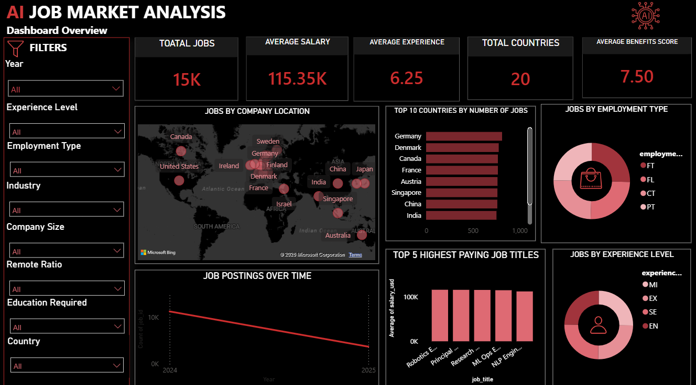
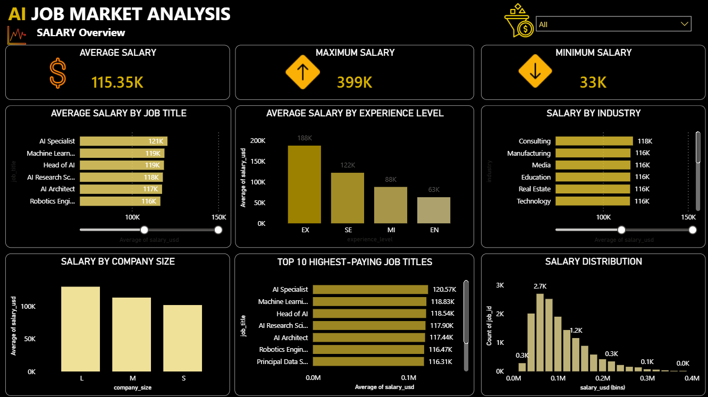
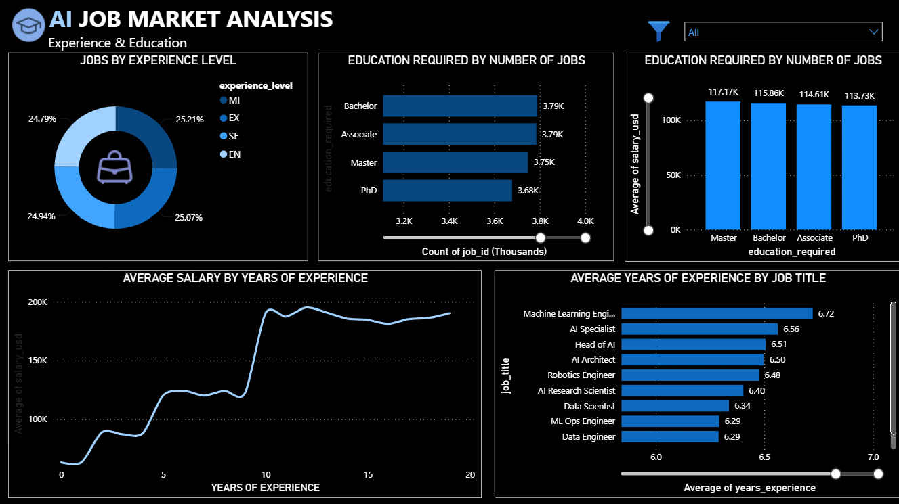
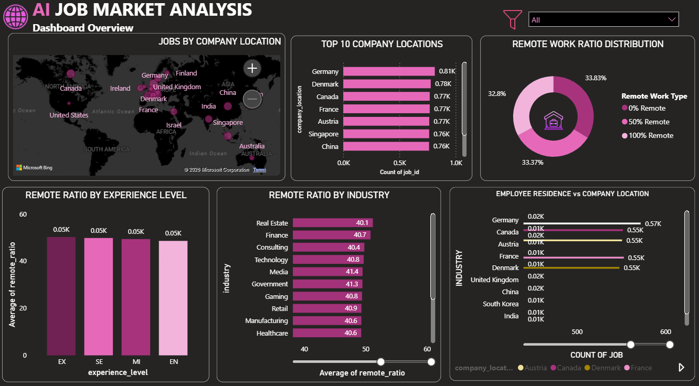

## 💭 My Experience

This was one of my first projects where I worked with a complete dataset and tried to turn it into something useful.

At the beginning, I was mainly focused on getting the charts and dashboard working. But while working on the project, I realized that making a dashboard is not only about creating charts. I also need to understand what the data is actually saying.

I faced some problems while cleaning the data and deciding which information was important enough to show in the dashboard. I also had to try different visualizations before deciding which ones made the most sense.

Working on this project helped me get more comfortable with Python, Pandas and Power BI. It also helped me understand the importance of asking the right questions before creating visualizations.

### What I learned

- How to work with a larger dataset
- How to clean and explore data using Python
- How to create visualizations in Power BI
- How to look for patterns instead of just making charts
- How to present data in a simple way
- How to improve a project by trying different approaches

### What I would improve

If I work on this project again, I would like to use more recent job-market data and add more analysis around skills and salary. I would also like to improve the dashboard further and make the insights more detailed.

Overall, this project gave me a better understanding of the complete data-analysis process, from working with raw data to presenting the final results.

## 📊 Power BI Dashboard

### Dashboard 1

### Dashboard 2

### Dashboard 3

### Dashboard 4

